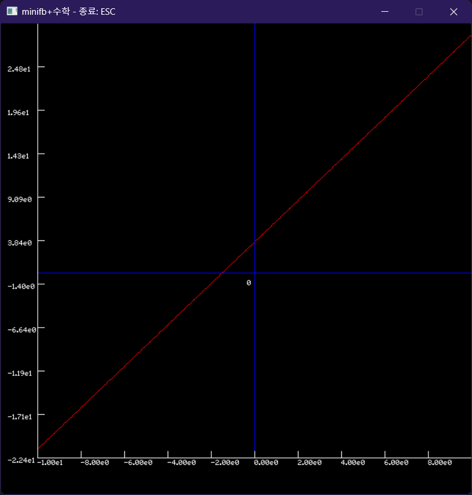

# mathwin ( feat: minifb of Rust )

I want to make Light GUI for Mathematical Play based on minifb crate with Rust programming language.

minifb 크레이트는 크기가 작아서 작동 원리를 이해하기 쉽고.

처리 속도가 빠른 편이라고 생각합니다.

이러한 minifb 크레이트를 기반으로... 

대량의 데이터 를 빠르게 처리하여,

2차원 애니메이션이나 그래프로 볼 수 있는 GUI 를 만드는 중입니다.


## To run this example:

원 그리는 기능 테스트
```
cargo run --example heart
```


<br>

선 그리는 기능 테스트
```
cargo run --example rotation
```


<br>

입자론으로 시뮬레이션 한 원자 내부.
('R' 키를 누르면 리셋 됨)
```rust
cargo run --example atoms
```


<br>

입자론으로 시뮬레이션 한 원자 내부
(전자 1만 개의 거동을 동시에 관찰함)


```rust
cargo run --example atoms_10000 --release
```
초기 모습 (입자론으로도 전자 궤도에 대해 말할 수 있을 것 같은 착각이 듭니다.)


<br>

시간이 흐른 후의 모습(이 모델은 전자 궤도에 대해 말할 수 없다는 생각이 듭니다.)


<br>

<함수의 그래프 그리기>

(1차 함수)
```rust
cargo run --example graph_order_1
```



<br>

(2차 함수)
```rust
cargo run --example graph_order_2
```


<br>


(3차 함수)
```rust
cargo run --example graph_order_3
```


<br>

(4차 함수)
```rust
cargo run --example graph_order_4
```


<br>

(heart 함수)
```rust
cargo run --example graph_hert
```


<br>


<br>
<br>
<br>

[.gitignore 파일의 내용]

target/
